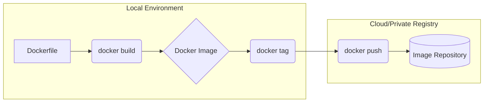

## What Is a Dockerfile?

A **Dockerfile** is a **text file** that contains instructions to build a Docker image.
In real projects, **need to build  own images using a Dockerfile**.

A Dockerfile defines:

* Base image
* Application files
* Environment variables
* Working directory
* Startup command

Kubernetes **never reads Dockerfiles**, but **runs images built from them**.

---

## Common Dockerfile Instructions

| Instruction | Purpose                             |
| ----------- | ----------------------------------- |
| FROM        | Base image                          |
| WORKDIR     | Working directory inside container  |
| COPY        | Copy files into image               |
| RUN         | Execute commands during build       |
| ENV         | Set environment variables           |
| EXPOSE      | Document container port             |
| CMD         | Default command (can be overridden) |
| ENTRYPOINT  | Fixed startup command               |

---

## 8.3 Hands-on Example: Simple Nginx Dockerfile

### Step 1: Create Project Structure

```bash
docker-demo/
├── Dockerfile
└── index.html
```

---

### Step 2: Create `index.html`

```html
<!DOCTYPE html>
<html>
<head>
  <title>Docker Demo</title>
</head>
<body>
  <h1>Hello from Custom Docker Image</h1>
</body>
</html>
```

---

### Step 3: Create `Dockerfile`

```Dockerfile
# 1. Base Image
FROM nginx:latest

# 2. Environment Variable
ENV APP_ENV=production

# 3. Working Directory
WORKDIR /usr/share/nginx/html

# 4. Copy application files
COPY index.html .

# 5. Expose container port
EXPOSE 80

# 6. Default command
CMD ["nginx", "-g", "daemon off;"]
```

---

## Dockerfile Line-by-Line Explanation

### FROM

```Dockerfile
FROM nginx:latest
```

* Uses official Nginx image
* Provides OS + Nginx preinstalled
* Every Dockerfile **must start with FROM**

---

### ENV

```Dockerfile
ENV APP_ENV=production
```

* Sets environment variable inside container
* Accessible by application
* Kubernetes can override this using ConfigMaps

---

### WORKDIR

```Dockerfile
WORKDIR /usr/share/nginx/html
```

* Sets default directory for:

  * COPY
  * RUN
  * CMD
* If directory does not exist, Docker creates it

---

### COPY

```Dockerfile
COPY index.html .
```

* Copies file from host → image
* `.` means current WORKDIR

---

### EXPOSE

```Dockerfile
EXPOSE 80
```

* Documents container port
* Does NOT publish the port
* Kubernetes uses this info conceptually

---

### CMD

```Dockerfile
CMD ["nginx", "-g", "daemon off;"]
```

* Default command when container starts
* Can be overridden at runtime
* Keeps Nginx running in foreground

---

## ENTRYPOINT vs CMD (Important Concept)

### ENTRYPOINT (Fixed)

```Dockerfile
ENTRYPOINT ["nginx"]
```

* Cannot be overridden easily
* Used for mandatory executables

---

### CMD (Flexible)

```Dockerfile
CMD ["-g", "daemon off;"]
```

* Acts as default arguments
* Kubernetes commonly overrides CMD

---

### Combined Example

```Dockerfile
ENTRYPOINT ["nginx"]
CMD ["-g", "daemon off;"]
```

---

## Build the Docker Image

From `docker-demo` directory:

```bash
docker build -t custom-nginx:v1 .
```

Explanation:

* `-t` → Tag name
* `.` → Current directory (build context)

Verify image:

```bash
docker images
```

---

## Run Container from Custom Image

```bash
docker run -d -p 8081:80 custom-nginx:v1
```

Access in browser:

```
http://localhost:8081
```

You should see **Hello from Custom Docker Image**

---

## Push Image to Docker Registry (Docker Hub)

### Step 1: Login

```bash
docker login
```

---

### Step 2: Tag Image

```bash
docker tag custom-nginx:v1 <dockerhub-username>/custom-nginx:v1
```

---

### Step 3: Push Image

```bash
docker push <dockerhub-username>/custom-nginx:v1
```

Now the image is available for **Kubernetes deployments**.

---

## Dockerfile → Docker Registry Flow



---

## How This Connects to Kubernetes

* Kubernetes **pulls images**, not Dockerfiles
* Image must exist in a registry
* Pods reference image name and tag
* Scaling = running more containers from same image
* CI/CD pipelines automate:

  * Docker build
  * Docker push
  * Kubernetes deploy

---

## Practice Tasks (Dockerfile)

1. Modify Dockerfile to change environment variable value
2. Rebuild image with new tag `v2`
3. Run two containers using `v1` and `v2`
4. Push both images to Docker Hub
5. Explain why Kubernetes needs the image tag

---

## Summary

You now understand:

* What a Dockerfile is
* Core Dockerfile instructions
* Difference between CMD and ENTRYPOINT
* How to build a custom image
* How images reach Docker Registry
* How Kubernetes consumes images

This completes the **full lifecycle**:

> **Dockerfile → Image → Registry → Kubernetes Pod**
