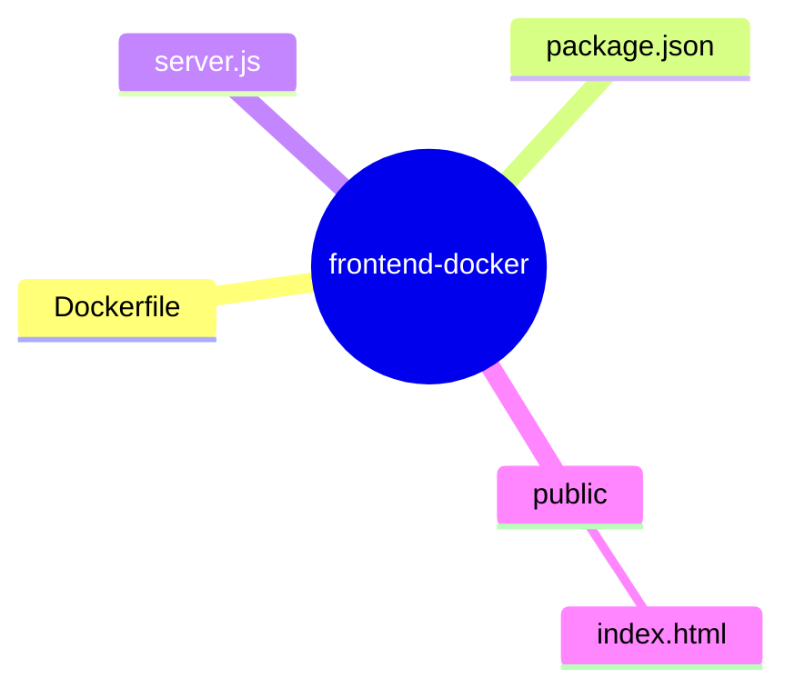

# Dockerfile Mastery Path (Docker-Only)

## Common Scenario

* **Application Type:** Frontend web app
* **Runtime:** Node.js + Express
* **Purpose:** Serve static frontend on port `3000`

> The app remains unchanged across all levels.
> Only the **Dockerfile improves**.

---

## Common Application Code (DO NOT CHANGE)




---

```yaml
frontend-docker/
├── Dockerfile        # Blueprint for the Docker image
├── package.json      # Node.js dependencies and scripts
├── server.js         # Main application logic
└── public/           # Static file directory
    └── index.html    # The main web page

```

---

### `index.html`

```html
<!DOCTYPE html>
<html lang="en">
<head>
  <meta charset="UTF-8" />
  <meta name="viewport" content="width=device-width, initial-scale=1.0" />
  <title>Professional Web Page</title>

  <style>
    :root {
      --primary: #2563eb;
      --secondary: #1e293b;
      --bg: #f8fafc;
      --text: #0f172a;
      --muted: #64748b;
      --card: #ffffff;
      --radius: 10px;
    }

    * {
      box-sizing: border-box;
      margin: 0;
      padding: 0;
      font-family: "Segoe UI", Roboto, Arial, sans-serif;
    }

    body {
      background: var(--bg);
      color: var(--text);
      line-height: 1.6;
    }

    header {
      background: linear-gradient(135deg, var(--primary), #1d4ed8);
      color: white;
      padding: 3rem 1.5rem;
      text-align: center;
    }

    header h1 {
      font-size: 2.5rem;
      margin-bottom: 0.5rem;
    }

    header p {
      font-size: 1.1rem;
      opacity: 0.95;
    }

    .container {
      max-width: 1100px;
      margin: auto;
      padding: 2rem 1.5rem;
    }

    section {
      margin-bottom: 3rem;
    }

    h2 {
      font-size: 1.8rem;
      color: var(--secondary);
      margin-bottom: 1rem;
      border-left: 4px solid var(--primary);
      padding-left: 0.75rem;
    }

    p {
      color: var(--muted);
      margin-bottom: 1rem;
    }

    .cards {
      display: grid;
      grid-template-columns: repeat(auto-fit, minmax(260px, 1fr));
      gap: 1.5rem;
      margin-top: 1.5rem;
    }

    .card {
      background: var(--card);
      padding: 1.5rem;
      border-radius: var(--radius);
      box-shadow: 0 10px 20px rgba(0,0,0,0.05);
      transition: transform 0.2s ease, box-shadow 0.2s ease;
    }

    .card:hover {
      transform: translateY(-4px);
      box-shadow: 0 15px 30px rgba(0,0,0,0.08);
    }

    .card h3 {
      margin-bottom: 0.5rem;
      color: var(--primary);
    }

    .card p {
      font-size: 0.95rem;
    }

    .cta {
      background: var(--secondary);
      color: white;
      padding: 2.5rem 1.5rem;
      border-radius: var(--radius);
      text-align: center;
    }

    .cta h2 {
      color: white;
      border: none;
      padding: 0;
    }

    .cta p {
      color: #cbd5f5;
      margin: 1rem 0 1.5rem;
    }

    .cta a {
      display: inline-block;
      background: var(--primary);
      color: white;
      padding: 0.75rem 1.5rem;
      border-radius: 6px;
      text-decoration: none;
      font-weight: 600;
      transition: background 0.2s ease;
    }

    .cta a:hover {
      background: #1d4ed8;
    }

    footer {
      text-align: center;
      padding: 1.5rem;
      font-size: 0.9rem;
      color: var(--muted);
      border-top: 1px solid #e2e8f0;
    }

    @media (max-width: 600px) {
      header h1 {
        font-size: 2rem;
      }
    }
  </style>
</head>
<body>

  <header>
    <h1>Professional Web Interface</h1>
  </header>

  <main class="container">

    <section>
      <h2>About This Page</h2>
      <p>
        This single-page design demonstrates a clean and professional UI suitable
        for demos, training labs, Docker examples, or production placeholders.
        It uses modern CSS practices and responsive layouts.
      </p>
    </section>

    <section>
      <h2>Key Features</h2>
      <div class="cards">
        <div class="card">
          <h3>Modern Design</h3>
          <p>Uses clean colors, spacing, and typography aligned with industry UI standards.</p>
        </div>
        <div class="card">
          <h3>Responsive Layout</h3>
          <p>Adapts smoothly across desktop, tablet, and mobile screen sizes.</p>
        </div>
        <div class="card">
          <h3>Docker Friendly</h3>
          <p>Lightweight static frontend ideal for Docker image demos and CI/CD pipelines.</p>
        </div>
      </div>
    </section>

    <section class="cta">
      <h2>Ready to Use</h2>
      <p>
        Drop this file into any container, web server, or static hosting platform
        and it’s ready to go.
      </p>
      <a href="#">Get Started</a>
    </section>

  </main>

  <footer>
    © 2026 • Professional Single Page Template
  </footer>

</body>
</html>

```

---

### `server.js`

```js
const express = require("express");
const app = express();

app.use(express.static("public"));

app.listen(3000, () => {
  console.log("Frontend running on port 3000");
});
```

---

### `package.json`

```json
{
  "name": "frontend-docker",
  "version": "1.0.0",
  "dependencies": {
    "express": "^4.18.2"
  }
}
```

---

# LEVEL 1 — BEGINNER DOCKERFILE (Just Works)

### Learning Goal

> Understand how Docker packages and runs an application

### Dockerfile – Beginner

```Dockerfile
FROM node:18

WORKDIR /app

COPY . .

RUN npm install

EXPOSE 3000

CMD ["node", "server.js"]
```

### Concepts Learned

* Base image usage
* Copying files
* Installing dependencies
* Running application

### Build & Run

```bash
docker build -t frontend:beginner .
docker run -p 3000:3000 frontend:beginner
```

---

# LEVEL 2 — INTERMEDIATE DOCKERFILE (Optimized Build)

### Learning Goal

> Improve caching, image size, and predictability

### Dockerfile – Intermediate

```Dockerfile
FROM node:18-alpine

WORKDIR /app

COPY package.json package-lock.json* ./
RUN npm install

COPY public ./public
COPY server.js .

ENV NODE_ENV=production

EXPOSE 3000

CMD ["node", "server.js"]
```

### Improvements Over Beginner

* Smaller base image
* Layer caching optimization
* Explicit file copying
* Environment variable usage

### Build & Run

```bash
docker build -t frontend:intermediate .
docker run -p 3000:3000 frontend:intermediate
```

---

# LEVEL 3 — PRODUCTION-GRADE DOCKERFILE (Industry Standard)

### Learning Goal

> Minimal, secure, production-ready image

### Dockerfile – Production

```Dockerfile
# -------- Build Stage --------
FROM node:18-alpine AS builder

WORKDIR /build

COPY package.json package-lock.json* ./
RUN npm install

COPY . .

RUN npm prune --production

# -------- Runtime Stage --------
FROM node:18-alpine

WORKDIR /app

ENV NODE_ENV=production

COPY --from=builder /build/node_modules ./node_modules
COPY --from=builder /build/public ./public
COPY --from=builder /build/server.js .

EXPOSE 3000

CMD ["node", "server.js"]
```

### Production Concepts

* Multi-stage builds
* Clean runtime image
* Reduced attack surface
* CI/CD friendly

### Build & Run

```bash
docker build -t frontend:prod .
docker run -p 3000:3000 frontend:prod
```

---

# Comparison
| Area           | Beginner | Intermediate | Production |
| -------------- | -------- | ------------ | ---------- |
| Image size     | Large    | Medium       | Small      |
| Caching        | Poor     | Better       | Best       |
| Security       | Low      | Medium       | High       |
| Build speed    | Slow     | Faster       | Fast       |
| Industry usage | No       | Partial      | Yes        |

---


### Same App → Extended Later

| Future Topic | What Will Change            |
| ------------ | --------------------------- |
| Volumes      | Persist logs, hot reload UI |
| Networking   | Frontend ↔ Backend          |
| Compose      | Multi-container app         |
| Security     | Non-root user, secrets      |
