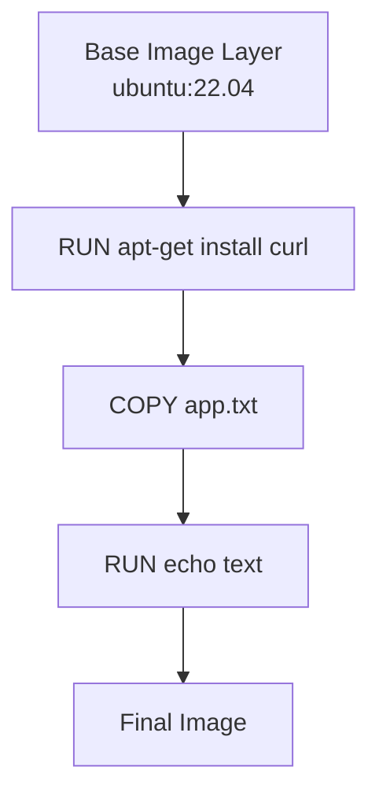
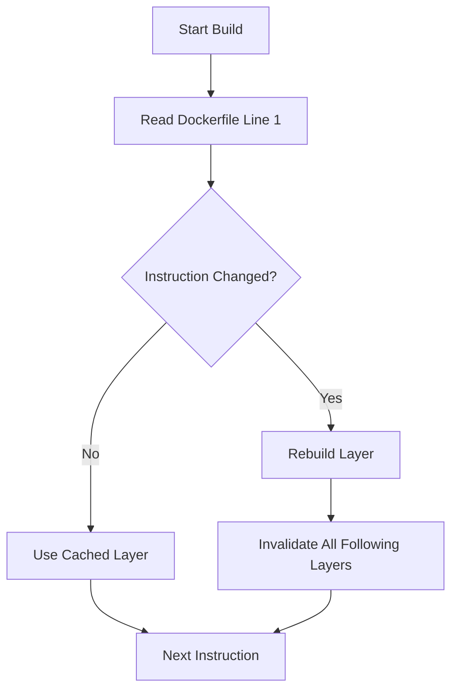
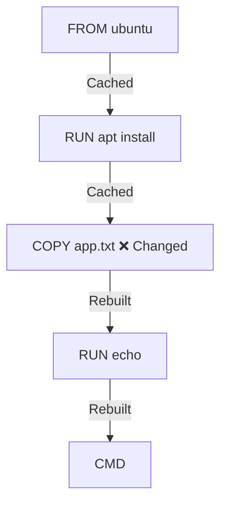

# 02 – Docker Image Layers and Caching

## 1. Basics: Docker Image Layers

### What Is a Docker Image?

A Docker image is a **stack of immutable layers** combined to form a runnable filesystem.

Each instruction in a `Dockerfile` creates **exactly one image layer**.

Common layer-creating instructions:

* `FROM`
* `RUN`
* `COPY`
* `ADD`

### Key Characteristics of Docker Image Layers

* Read-only and immutable
* Cached locally after build
* Reusable across multiple images
* Shared between containers
* Stacked in order to form the final image

Docker uses a **Union File System (UnionFS)** to merge all layers into a single view.

---

### Docker Image Layer Stack (Visual)



Each box represents **one Dockerfile instruction → one layer**.

---

## 2. Docker Layer Caching Explained

### What Is Docker Layer Caching?

Docker caches each layer **after it is built**.
If nothing changes, Docker **reuses cached layers** instead of rebuilding them.

### How Cache Works (Rules)

* Docker reads the Dockerfile **top to bottom**
* Each instruction is compared with the previous build
* If an instruction is unchanged → **cache hit**
* If an instruction changes → **cache miss**
* On cache miss → that layer and **all layers below it are rebuilt**

---

### Cache Behavior Flow



---

## 3. Hands-on Practice: Understanding Layers and Cache

### Step 1: Create a Working Directory

```bash
mkdir layers-demo
cd layers-demo
```

---

### Step 2: Create a Sample Dockerfile

Create a file named `Dockerfile`:

```Dockerfile
FROM ubuntu:22.04

RUN apt-get update && apt-get install -y curl

COPY app.txt /app.txt

RUN echo "Docker Layers Demo" >> /app.txt

CMD ["cat", "/app.txt"]
```

---

### Step 3: Create Application File

Create `app.txt`:

```text
Hello from Docker
```

---

### Step 4: Build the Image

```bash
docker build -t layers-demo:1.0 .
```

**Observe:**

* Each Dockerfile instruction creates a layer
* Docker stores these layers in cache

---

### Step 5: Rebuild the Image (Cache Hit)

```bash
docker build -t layers-demo:1.0 .
```

Expected output:

```text
Using cache
```

Docker reused all previously built layers.

---

### Step 6: Modify the Application File (Cache Miss)

Edit `app.txt`:

```text
Hello from Docker - Updated
```

Rebuild:

```bash
docker build -t layers-demo:1.0 .
```

**Observation:**

* `COPY app.txt` layer is rebuilt
* All layers **after COPY** are rebuilt
* Layers **before COPY** remain cached

---

### Cache Invalidation Visualization



---

### Step 7: Run the Container

```bash
docker run --rm layers-demo:1.0
```

Expected output:

```text
Hello from Docker - Updated
Docker Layers Demo
```

---

## 4. Best Practices for Layer Caching

### Optimize Dockerfile Instruction Order

**Rule of Thumb:**

* Put **rarely changing instructions first**
* Put **frequently changing files last**

---

### Bad Example (Poor Caching)

```Dockerfile
COPY . .
RUN apt-get update && apt-get install -y curl
```

Any file change breaks the cache.

---

### Good Example (Optimized Caching)

```Dockerfile
RUN apt-get update && apt-get install -y curl
COPY . .
```

Package layer is cached unless dependencies change.

---

### Reduce Layers by Combining Commands

```Dockerfile
RUN apt-get update && \
    apt-get install -y curl && \
    rm -rf /var/lib/apt/lists/*
```

Benefits:

* Fewer layers
* Smaller image size
* Cleaner filesystem

---

## 5. Common Docker Layer Mistakes

| Mistake                         | Impact             |
| ------------------------------- | ------------------ |
| Too many RUN commands           | Larger image       |
| COPY before installing packages | Cache invalidation |
| Not cleaning package cache      | Image bloat        |
| Rebuilding unchanged layers     | Slower builds      |

---

## 6. Why Layers & Caching Matter

Understanding layers helps you:

* Speed up Docker builds
* Reduce image size
* Improve CI/CD build time
* Debug image changes easily
* Write production-grade Dockerfiles

This is **mandatory knowledge** before moving to:

* Volumes
* Networking
* Multi-stage builds

---

## 7. Conclusion and Summary

By the end of this module, you understand:

* What Docker image layers are
* How each Dockerfile instruction creates a layer
* How Docker caching works internally
* What causes cache invalidation
* How to optimize Dockerfiles for faster builds

Mastering layers and caching is the **foundation of professional Docker usage**.

---

## 8. Practice Questions

### Conceptual

1. What is a Docker image layer?
2. Why are Docker layers immutable?
3. What is Docker layer caching?
4. Why does Docker rebuild layers after a change?

### Command-Based

5. Command to build a Docker image
6. How do you tag an image during build?
7. Command to run a container from an image

### Hands-on

8. Change only the `CMD` instruction and rebuild
9. Observe which layers are rebuilt
10. Reorder Dockerfile instructions to maximize cache reuse

