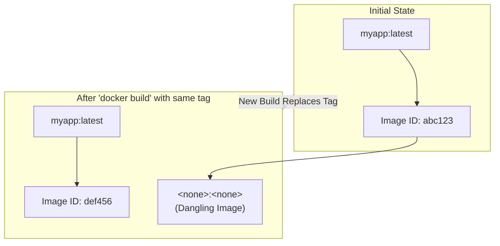
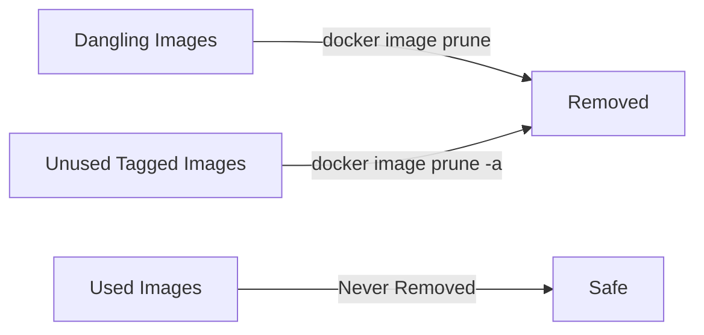

# 02.02 Docker Dangling Images – Complete Practice Guide

## 1. What Are Docker Dangling Images?

**Dangling images** are Docker images that:

* Have **no repository name**
* Have **no tag**
* Appear as:

  ```
  <none>:<none>
  ```
* Are **not referenced** by any container
* Are **not directly usable**

They usually exist as **leftover image layers** and only **consume disk space**.

---

### Key Properties

* Cannot be run directly
* Not linked to any container
* Safe to remove
* Accumulate silently over time

---

## 2. Why Dangling Images Are Created

Dangling images are created when Docker **replaces image references** during builds.

### Common Scenarios

* Rebuilding an image with the **same name**
* Tagging a new version of an image
* A build **fails midway**
* CI/CD pipelines that build frequently

---

### Example: How Dangling Images Are Created

```bash
docker build -t myapp:v1 .
docker build -t myapp:v2 .
```

What happens:

* `myapp:v2` points to the latest image
* Old image layers lose their tag
* Old image becomes `<none>:<none>` → **dangling**

---

### Image Reference Flow (Visual)



---

## 3. Listing Dangling Images

### Command (Recommended)

```bash
docker images -f dangling=true
```

### Sample Output

```
REPOSITORY   TAG       IMAGE ID       CREATED        SIZE
<none>       <none>    a1b2c3d4e5f6   2 days ago     125MB
```

---

### List All Images (For Comparison)

```bash
docker images
```

Look specifically for:

```
<none>   <none>
```

---

## 4. Removing Dangling Images (Safe Cleanup)

### Recommended Cleanup Command

```bash
docker image prune
```

### Interactive Warning

```
WARNING! This will remove all dangling images.
Are you sure you want to continue? [y/N]
```

Type:

```bash
y
```

 This removes **only dangling images**

---

### Force Cleanup (No Prompt)

```bash
docker image prune -f
```

Useful for:

* CI pipelines
* Automation
* Scheduled cleanup jobs

---

## 5. Removing a Specific Dangling Image

If you want fine-grained control:

```bash
docker rmi <IMAGE_ID>
```

Example:

```bash
docker rmi a1b2c3d4e5f6
```

---

## 6. Removing ALL Unused Images

```bash
docker image prune -a
```

This removes:

* Dangling images
* Unused tagged images

**Danger Zone**

* Can remove images you may reuse later
* Avoid running casually on shared systems

---

### Cleanup Scope Comparison




## 7. Dangling vs Unused vs Used Images

| Image Type     | Description         | Safe to Delete |
| -------------- | ------------------- | -------------- |
| Dangling Image | `<none>:<none>`     | Yes          |
| Unused Image   | Tagged but unused   | Depends     |
| Used Image     | Linked to container | No           |

---

## 8. Disk Space Check (Before & After)

### Command

```bash
docker system df
```

Shows usage of:

* Images
* Containers
* Volumes
* Build cache

### Why This Matters

* Dangling images can consume **GBs of disk**
* Disk pressure causes:

  * Build failures
  * Slow Docker performance
  * CI pipeline issues

---

## 9. Best Practices (Production-Safe)

* Clean dangling images **regularly**
* Always prefer:

  ```bash
  docker image prune
  ```
* Avoid `-a` unless you understand impact
* In CI/CD:

  * Cleanup **after builds**
  * Avoid disk bloat on agents

---

## 10. Practice Tasks

1. Build an image twice with different tags
2. Run:

   ```bash
   docker images
   ```
3. Identify `<none>:<none>` images
4. Run:

   ```bash
   docker image prune
   ```
5. Verify disk usage:

   ```bash
   docker system df
   ```

---

## 11. One-Line Demo Command

```bash
docker images -f dangling=true && docker image prune -f
```

Shows:

* What will be removed
* Then removes it cleanly

---

**Understanding dangling images is essential for maintaining a clean, efficient Docker environment.**
