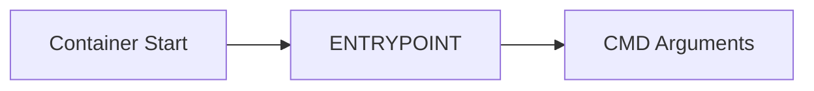
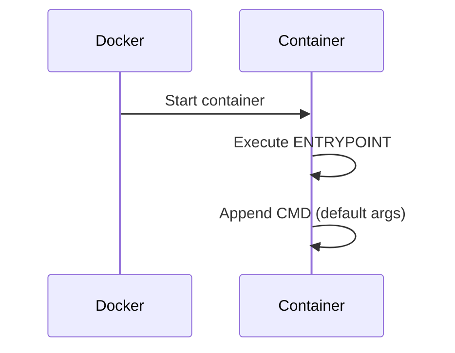
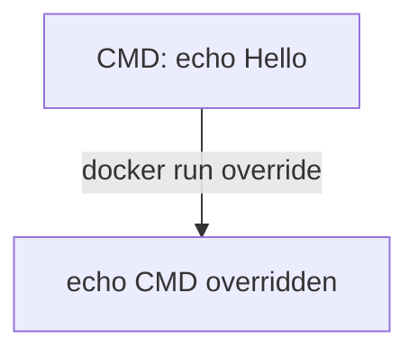
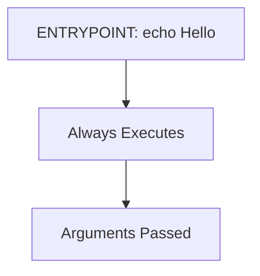
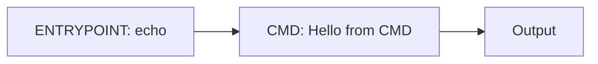
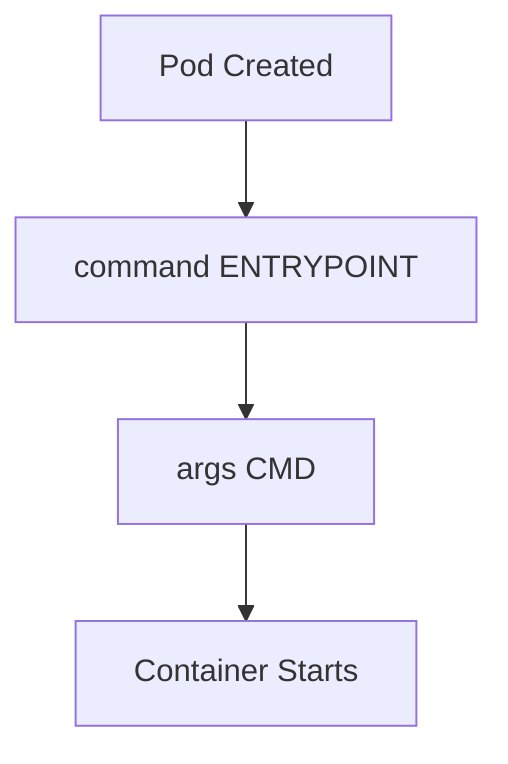

# 03 – CMD vs ENTRYPOINT in Docker

## 1. Basics: CMD and ENTRYPOINT

When a Docker container starts, Docker decides **what to run** using **CMD** and **ENTRYPOINT**.

Think of it as:

> **ENTRYPOINT = what to run**
> **CMD = how to run it (default arguments)**

---

## CMD

`CMD` defines the **default command or arguments** for the container.

### Key Characteristics

* Provides **default behavior**
* Can be **overridden at runtime**
* Only **one CMD is effective** (last one wins)
* Often used for **arguments**, not executables

### Syntax Forms

```Dockerfile
CMD ["executable", "param1", "param2"]   # exec form (recommended)
CMD command param1 param2               # shell form
```

---

## ENTRYPOINT

`ENTRYPOINT` defines the **main executable** of the container.

### Key Characteristics

* Defines **what always runs**
* Not overridden by default arguments
* Makes container behave like a **binary**
* Best for **main application**

### Syntax Forms

```Dockerfile
ENTRYPOINT ["executable", "param1"]   # exec form (recommended)
ENTRYPOINT command param1            # shell form
```

---

## 2. CMD vs ENTRYPOINT – Conceptual Difference

### Mental Model



* ENTRYPOINT always executes
* CMD provides default parameters

---

### Comparison Table

| Feature          | CMD                    | ENTRYPOINT       |
| ---------------- | ---------------------- | ---------------- |
| Purpose          | Default command / args | Fixed executable |
| Overridable      | Easy                   | Not by default |
| Typical Use      | Arguments              | Application      |
| Last one wins    | ✅                    | ❌                |
| Recommended Form | Exec                   | Exec             |

---

## 3. How CMD and ENTRYPOINT Work Together

When **both are defined**:

* ENTRYPOINT = executable
* CMD = default arguments

---

### Combined Example

```Dockerfile
ENTRYPOINT ["echo"]
CMD ["Hello World"]
```

Runtime behavior:

```bash
docker run image-name
```

Output:

```text
Hello World
```

Override CMD:

```bash
docker run image-name "Hello Docker"
```

Output:

```text
Hello Docker
```

---

### Runtime Execution Flow



---

## 4. Hands-on Practice: CMD vs ENTRYPOINT

---

### Step 1: Create Working Directory

```bash
mkdir cmd-entrypoint-demo
cd cmd-entrypoint-demo
```

---

### Step 2: Dockerfile with CMD

Create `Dockerfile.cmd`:

```Dockerfile
FROM ubuntu:22.04
CMD ["echo", "Hello from CMD"]
```

Build:

```bash
docker build -t cmd-demo -f Dockerfile.cmd .
```

Run:

```bash
docker run cmd-demo
```

Output:

```text
Hello from CMD
```

Override CMD:

```bash
docker run cmd-demo echo "CMD overridden"
```

---

### CMD Override Visualization



---

### Step 3: Dockerfile with ENTRYPOINT

Create `Dockerfile.entrypoint`:

```Dockerfile
FROM ubuntu:22.04
ENTRYPOINT ["echo", "Hello from ENTRYPOINT"]
```

Build:

```bash
docker build -t entrypoint-demo -f Dockerfile.entrypoint .
```

Run:

```bash
docker run entrypoint-demo
```

Output:

```text
Hello from ENTRYPOINT
```

Override attempt:

```bash
docker run entrypoint-demo echo "Trying override"
```

 **Observation**
ENTRYPOINT still executes → override does **not replace** it.

---

### ENTRYPOINT Behavior Visualization



---

### Step 4: Combined CMD and ENTRYPOINT

Create `Dockerfile.combined`:

```Dockerfile
FROM ubuntu:22.04
ENTRYPOINT ["echo"]
CMD ["Hello from CMD"]
```

Build:

```bash
docker build -t combined-demo -f Dockerfile.combined .
```

Run:

```bash
docker run combined-demo
```

Output:

```text
Hello from CMD
```

Override CMD only:

```bash
docker run combined-demo "Hello World"
```

Output:

```text
Hello World
```

---

### Combined Execution Diagram



---

## 5. CMD vs ENTRYPOINT – Best Practices

### Recommended Patterns

 Use `ENTRYPOINT` for:

* Main application
* Long-running services
* Mandatory startup behavior

 Use `CMD` for:

* Default arguments
* Configurable options

---

### Always Prefer Exec Form

```Dockerfile
ENTRYPOINT ["nginx", "-g", "daemon off;"]
```

Avoid shell form in production:

```Dockerfile
ENTRYPOINT nginx -g "daemon off;"   ❌
```

---

## 6. Kubernetes Mapping (Conceptual Bridge)

Docker concepts map **directly** to Kubernetes Pod fields.

### Mapping Table

| Docker              | Kubernetes        |
| ------------------- | ----------------- |
| ENTRYPOINT          | command           |
| CMD                 | args              |
| docker run override | Pod spec override |

---

### Pod Startup Flow



---

## 7. Why CMD & ENTRYPOINT Matter (Real World)

Understanding this helps you:

* Avoid container startup failures
* Override behavior safely
* Debug image issues
* Write reusable, flexible images

Critical for:

* Pods
* Init Containers
* Jobs
* CronJobs

---

## 8. Conclusion and Summary

At the end of this module, you understand:

* What CMD and ENTRYPOINT do
* How override behavior works
* How they work together
* Why exec form matters
* How Docker startup logic maps to Kubernetes

This knowledge is **mandatory for production-grade containers**.

---

## 9. Practice Questions

### Conceptual

1. What is the purpose of CMD?
2. What is the purpose of ENTRYPOINT?
3. Why is ENTRYPOINT preferred for applications?
4. Why is exec form recommended?
