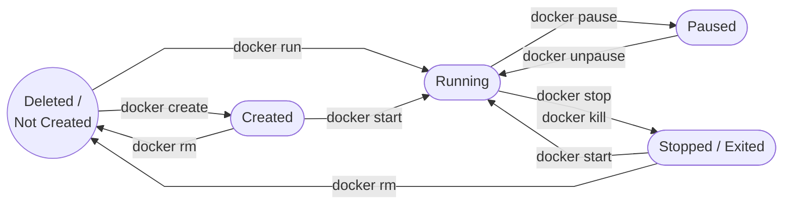

# Demo - Container Lifecycle


We will use a simple Alpine Linux container running a continuous `ping` command so it stays alive long enough for us to manipulate it.


## FLow-Diagram



## Step 1: The "Created" State

First, we will create the container without starting it. This allocates the file system and prepares the container, but does not execute the process.

```bash
docker create --name lifecycle-demo alpine ping localhost

```

Now, check its status. Notice we have to use `-a` (all) because it is not currently running.

```bash
docker ps -a | grep lifecycle-demo

```

**Expected Output:**

```text
CONTAINER ID   IMAGE     COMMAND            CREATED          STATUS    
abc123def456   alpine    "ping localhost"   10 seconds ago   Created   

```

---

## Step 2: The "Running" State

Now let's start the container we just created.

```bash
docker start lifecycle-demo

```

Check the running containers. You no longer need the `-a` flag because the container is active.

```bash
docker ps | grep lifecycle-demo

```

**Expected Output:**

```text
CONTAINER ID   IMAGE     COMMAND            CREATED          STATUS         
abc123def456   alpine    "ping localhost"   45 seconds ago   Up 3 seconds   

```

---

## Step 3: The "Paused" State

Let's freeze the container. This suspends the `ping` process in memory without destroying it.

```bash
docker pause lifecycle-demo

```

Check the status again:

```bash
docker ps | grep lifecycle-demo

```

**Expected Output:** (Notice the explicit `(Paused)` tag)

```text
CONTAINER ID   IMAGE     COMMAND            CREATED         STATUS                   
abc123def456   alpine    "ping localhost"   1 minute ago    Up 20 seconds (Paused)   

```

---

## Step 4: Unpause back to "Running"

Let's thaw the process out so it resumes exactly where it left off.

```bash
docker unpause lifecycle-demo

```

*(If you run `docker ps` now, you will see the `(Paused)` tag is gone).*

---

## Step 5: The "Stopped" (Exited) State

Now we gracefully shut the container down. Docker sends a `SIGTERM` signal to the `ping` process, telling it to stop.

```bash
docker stop lifecycle-demo

```

Check the status. Because it is no longer running, we need `-a` again.

```bash
docker ps -a | grep lifecycle-demo

```

**Expected Output:**

```text
CONTAINER ID   IMAGE     COMMAND            CREATED         STATUS                     
abc123def456   alpine    "ping localhost"   2 minutes ago   Exited (137) 5 seconds ago 

```

*Note: The exit code `137` usually means the process was terminated by the operating system (which is what `docker stop` does).*

---

##  Step 6: The "Deleted" State

The container is stopped, but it still exists on your hard drive. If you run `docker start lifecycle-demo` right now, it will boot back up.

To permanently destroy it and reclaim the disk space, you must remove it.

```bash
docker rm lifecycle-demo

```

Run one final check:

```bash
docker ps -a | grep lifecycle-demo

```

**Expected Output:**
*(Nothing. The container has been completely erased.)*
