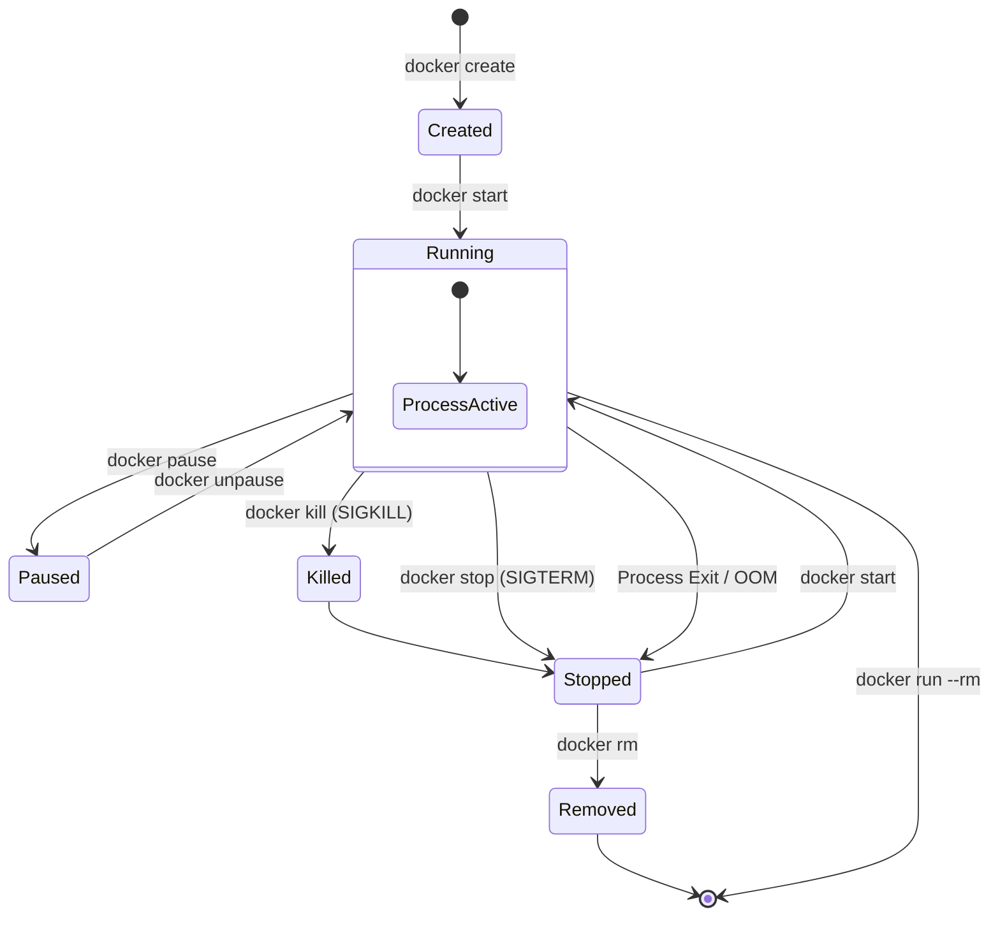
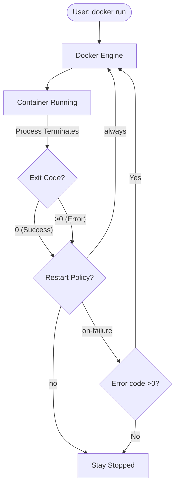
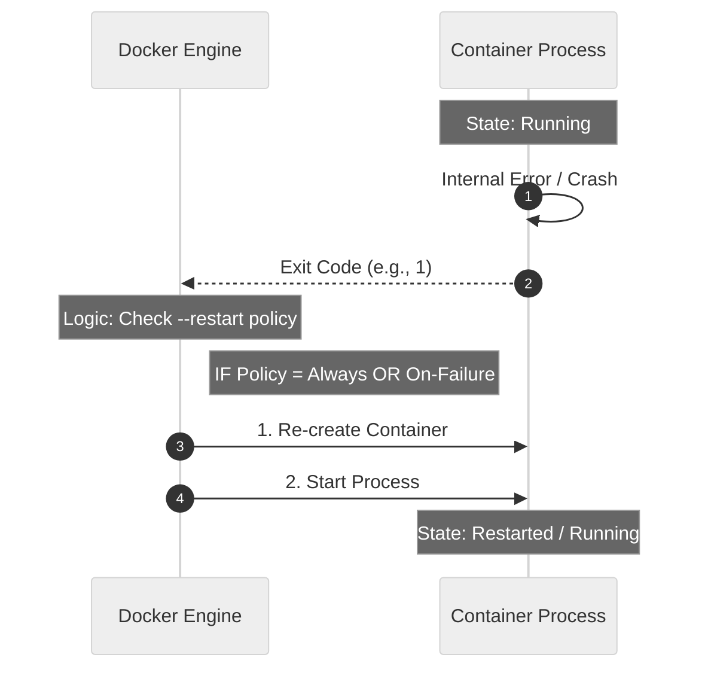
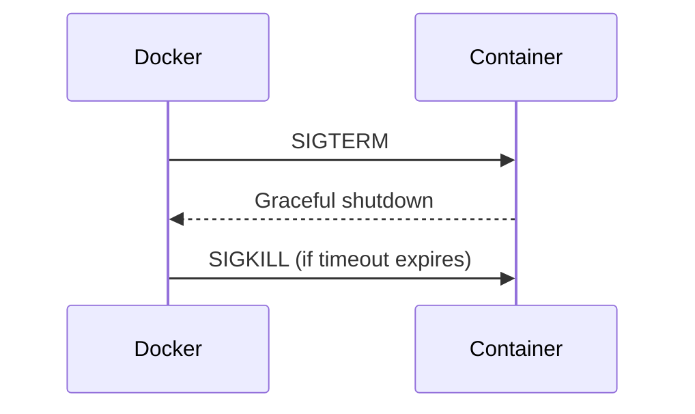

# 04 – Container Lifecycle: Start, Stop, and Restart

## 1. Basics: Container Lifecycle

A Docker container follows a **well-defined lifecycle** from creation to deletion.
Understanding this lifecycle is essential for:

* Debugging container issues
* Automating container operations
* Preparing for Kubernetes concepts

Containers are **ephemeral by design**.
Once stopped and removed, they **do not retain state** unless external storage (volumes or bind mounts) is used. Storage persistence is covered separately in volume concepts.

---

## 2. Container Lifecycle Stages

### Lifecycle Stages Overview

1. Created
2. Started
3. Running
4. Paused (optional)
5. Stopped
6. Removed

---

### Lifecycle Flow Diagram



---

## 3. Container Lifecycle States Explained

### Created

* Container is created but not running
* Filesystem and metadata exist
* ENTRYPOINT / CMD is not executed

Command example:

```bash
docker create nginx
```

---

### Running

* Main container process is executing
* Application is actively running
* Container appears in `docker ps`

---

### Paused

* Container execution is temporarily frozen
* Processes are suspended using cgroups
* Network and memory state are preserved

Used mainly for debugging or temporary resource control.

---

### Stopped

* Main process has exited
* Container still exists on disk
* Can be restarted without rebuilding

---

### Removed

* Container metadata is deleted
* Filesystem layer is removed
* Container cannot be restarted

---

## 4. Container Lifecycle Mapping (Docker vs Kubernetes)

Although Docker and Kubernetes use different abstractions, lifecycle concepts align closely.

### Lifecycle Mapping Table

| Docker Action  | Kubernetes Equivalent |
| -------------- | --------------------- |
| docker create  | Pod creation          |
| docker start   | Container start       |
| docker stop    | Pod termination       |
| docker restart | Pod restart           |
| docker rm      | Pod deletion          |

Kubernetes continuously monitors containers and may **restart them automatically** based on restart policies.

---

### Lifecycle Responsibility Model



---

## 5. Hands-on Practice: Container Lifecycle Commands

---

### Step 1: Create a Container (Not Started)

```bash
docker create --name lifecycle-demo nginx
```

Verify state:

```bash
docker ps -a
```

Expected state:

```
Created
```

---

### Step 2: Start the Container

```bash
docker start lifecycle-demo
```

Verify:

```bash
docker ps
```

Expected state:

```
Running
```

---

### Step 3: Stop the Container Gracefully

```bash
docker stop lifecycle-demo
```

What happens internally:

* Docker sends `SIGTERM`
* Application gets time to shut down cleanly

Verify:

```bash
docker ps -a
```

State:

```
Exited
```

---

### Step 4: Restart the Container

```bash
docker restart lifecycle-demo
```

This command internally performs:

1. Stop
2. Start

---

### Restart Flow Diagram



---

### Step 5: Pause and Unpause the Container

```bash
docker pause lifecycle-demo
docker unpause lifecycle-demo
```

Effect:

* All container processes are frozen
* Container is not stopped or restarted

---

### Step 6: Remove the Container

```bash
docker rm lifecycle-demo
```

Force remove (even if running):

```bash
docker rm -f lifecycle-demo
```

Force removal sends `SIGKILL` and deletes the container immediately.

---

## 6. Signals and Graceful Shutdown

### What Happens During `docker stop`



### Default Behavior

* SIGTERM is sent first
* Docker waits **10 seconds**
* SIGKILL is sent if container does not exit

---

### Custom Timeout

```bash
docker stop -t 30 lifecycle-demo
```

This gives the application **30 seconds** to shut down gracefully.

---

## 7. How This Helps in Learning Kubernetes

Understanding container lifecycle enables you to:

* Debug crashing containers
* Understand restart behavior
* Implement graceful shutdown logic
* Design resilient services

Kubernetes relies on container lifecycle events for:

* Health checks
* Auto-healing
* Rolling deployments
* Pod termination handling

---

## 8. Conclusion and Summary

At the end of this module, you should understand:

* All container lifecycle states
* Difference between create, start, stop, restart, and remove
* How signals control shutdown behavior
* Why containers are ephemeral
* How Docker lifecycle concepts map to Kubernetes

This knowledge is foundational for **stable, predictable containerized applications**.

---

## 9. Practice Questions

### Conceptual

1. What is the difference between stop and remove?
2. What happens when a container receives SIGTERM?
3. Why are containers considered ephemeral?
4. What is the paused state used for?

---

### Command-Based

5. Command to create a container without starting it
6. Command to gracefully stop a container
7. Command to restart a container
8. Command to force remove a running container

---

### Kubernetes-Oriented

9. How does Kubernetes handle container restarts?
10. What happens to a Pod when its container crashes?
11. Why is graceful shutdown important in Kubernetes?
