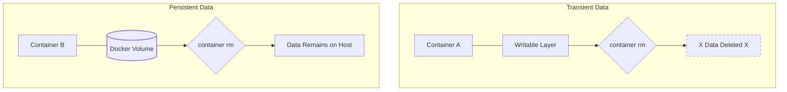
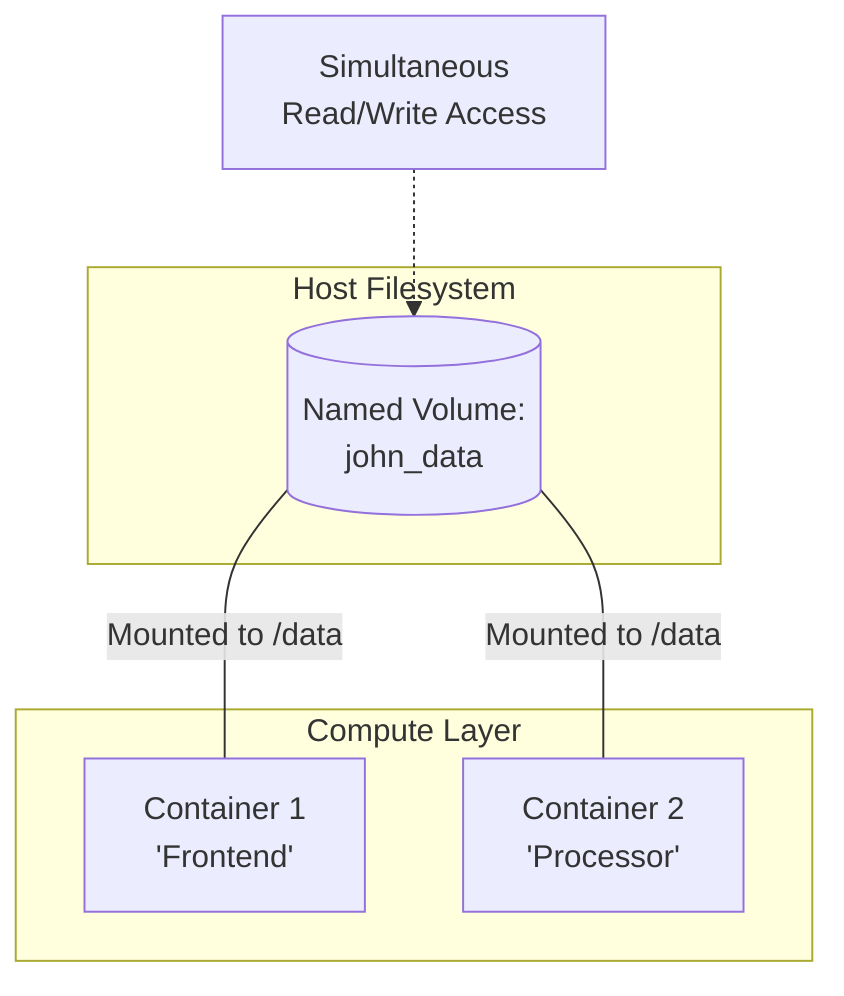
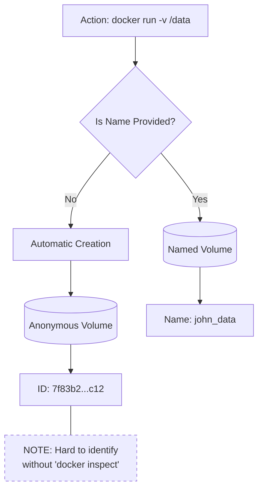
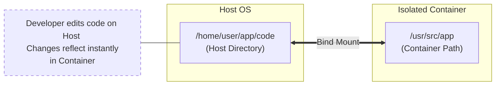
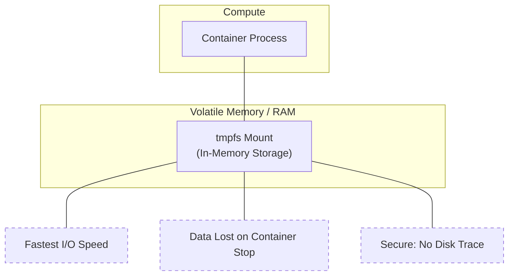
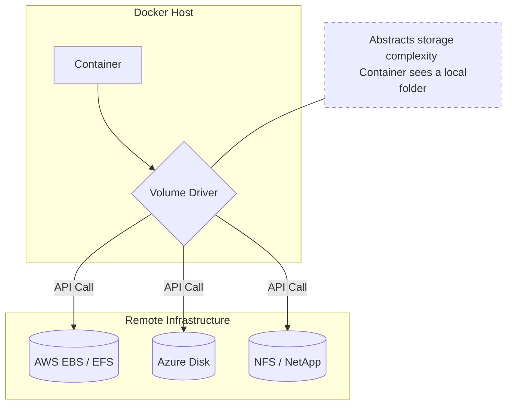

# Docker Volumes (Core Concepts and Types)

## 1. Why Docker Volumes Exist

Docker containers are **ephemeral by nature**.
When a container is deleted, **all data inside its writable layer is lost**.

Docker volumes solve this problem by storing data **outside the container’s Union File System**, making data:

* Persistent across container restarts
* Independent of container lifecycle
* Shareable across multiple containers
* Safer during upgrades and rebuilds

---

### Why We Use Volumes

* Keep container images **immutable**
* Keep containers **stateless**
* Persist important data such as:

  * Databases
  * Logs
  * Uploaded files
  * Application state

---

### Without vs With Volumes



---

## 2. What Is a Docker Volume

A **Docker volume** is a directory managed by Docker and stored outside the container filesystem.

Key characteristics:

* Managed by Docker
* Lives under `/var/lib/docker/volumes/`
* Independent of container lifecycle
* Can be mounted into one or more containers

---

## 3. Types of Docker Volumes

Docker supports **multiple data persistence mechanisms**, each designed for different use cases.

### Volume Types Overview

| Type                           | Managed By | Persistent              | Portable |
| ------------------------------ | ---------- | ----------------------- | -------- |
| Named Volume                   | Docker     | Yes                     | Yes      |
| Anonymous Volume               | Docker     | Yes (but hard to reuse) | Limited  |
| Bind Mount                     | Host OS    | Yes                     | No       |
| tmpfs Mount                    | Memory     | No                      | No       |
| Volume Driver (Cloud / Plugin) | External   | Yes                     | Yes      |

---

## 4. Named Volumes

### Definition

A **named volume** is a volume explicitly created and named by the user and managed entirely by Docker.

### Where is the data ?

On Windows with WSL 2, created named volumes are stored inside a specialized Linux filesystem virtual disk (.vhdx file).

Example:

```bash
docker volume create john_data
```

---

### How It Works



---

### Functions / Use Cases

* Database storage
* Application uploads
* Shared data between containers
* Production workloads

---

### Advantages

* Easy to manage
* Easy to back up
* Portable across environments
* Safe default for most use cases

---

### Limitations

* Stored in Docker’s internal directory
* Not directly visible unless inspected
* Requires Docker CLI to manage

---

## 5. Anonymous Volumes (Unnamed Volumes)

### Definition

An **anonymous volume** is automatically created by Docker when a container declares a volume but no name is specified.

Example:

```bash
docker run -v /data nginx
```

---

### How It Works



---

### Functions / Use Cases

* Temporary persistence
* Avoid overwriting container image data
* Quick testing

---

### Advantages

* Automatic creation
* No manual volume management

---

### Limitations

* Difficult to reuse
* Hard to identify
* Often forgotten and accumulate on disk

---

## 6. Bind Mounts

### Definition

A **bind mount** maps a **specific directory or file from the host** directly into the container.

Example:

```bash
docker run -v /host/path:/container/path nginx
```

---

### How It Works



---

### Functions / Use Cases

* Local development
* Source code mounting
* Log inspection
* Debugging

---

### Advantages

* Immediate host visibility
* No Docker-managed storage
* Simple for developers

---

### Limitations

* Not portable
* Tightly coupled to host OS
* Risk of overwriting container files
* Security exposure if misused

---

## 7. tmpfs Mounts

### Definition

A **tmpfs mount** stores data **in memory only**.
Data is lost when the container stops.

Example:

```bash
docker run --tmpfs /app/cache nginx
```

---

### How It Works



---

### Functions / Use Cases

* Sensitive data
* Temporary cache
* Session storage
* Performance-critical workloads

---

### Advantages

* Very fast
* No disk I/O
* Data never touches disk

---

### Limitations

* Data is not persistent
* Memory consumption
* Data lost on restart

---

## 8. Volume Drivers (Cloud / Plugin Volumes)

### Definition

Docker volumes can be backed by **external storage systems** using volume drivers.

Examples:

* NFS
* Amazon EBS
* Azure Disk
* Ceph
* GlusterFS

---

### How It Works



---

### Functions / Use Cases

* Distributed storage
* Multi-host environments
* High availability setups
* Cloud-native workloads

---

### Advantages

* Highly scalable
* Persistent beyond single host
* Suitable for clustered systems

---

### Limitations

* Requires plugin installation
* Higher complexity
* Depends on network availability
* Performance depends on backend

---

## 9. Practical Volume Exercise (Recap)

This exercise demonstrates **named volume persistence**:

* Data survives container deletion
* Storage is independent of container lifecycle

Key takeaway:

> Volumes keep data alive even when containers die.
